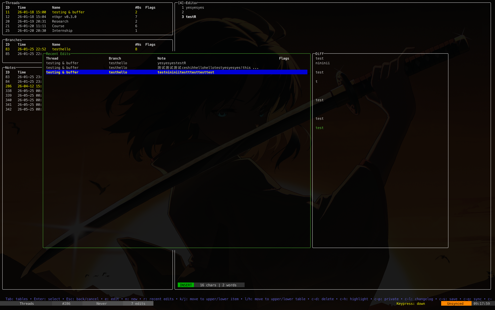

# ntkpr



## Introduction

`ntkpr` is a terminal journal management tool with a TUI interface for structured note-taking. Notes are organized in a three-level hierarchy inspired by version control: **Thread → Branch → Note**.

- **Threads** are top-level topics or projects.
- **Branches** subdivide a thread into separate tracks or phases.
- **Notes** are the individual entries within a branch.

Each thread and branch has a summary/description page. Changes are kept in memory and synced to a local SQLite database on demand — no auto-save.

The tool also ships a semantic search pipeline: notes are embedded via a local embedding server and stored in a `sqlite-vec` vector table, enabling `ntkpr related <note-id>` to retrieve the most semantically similar notes.

## Installation

`ntkpr` runs on macOS, Linux, and Windows (via WSL).

**Prerequisite:** Go.

### macOS

```bash
curl -L https://github.com/haochend413/ntkpr/releases/latest/download/ntkpr_darwin_arm64 -o ntkpr
chmod +x ntkpr && sudo mv ntkpr /usr/local/bin/
```

### Linux

```bash
curl -L https://github.com/haochend413/ntkpr/releases/latest/download/ntkpr_linux_amd64 -o ntkpr
chmod +x ntkpr && sudo mv ntkpr /usr/local/bin/
```

### Local Build

```bash
git clone https://github.com/haochend413/ntkpr
cd ntkpr/ntkpr
go build -o ntkpr .
```

Scripts in `/scripts/` can automate the build and add the binary to your path.

## Usage

```bash
ntkpr                              # launch the TUI
ntkpr backup [path]                # backup config, state, and database (default: cwd)
ntkpr export                       # export notes to JSON
ntkpr related <note-id>            # print a note and its top 5 semantically related notes
ntkpr related <note-id> --reset-reembed  # rebuild the vector table and re-embed all notes first
ntkpr gui                          # launch the web GUI (requires Node.js / pnpm)
```

## Keymaps

### Global

| Key | Action |
|-----|--------|
| `Tab` | Cycle focus: Threads → Branches → Notes → Threads |
| `Ctrl+C` | Quit (opens confirmation) |
| `Ctrl+Q` | Sync in-memory changes to database |
| `H` | Toggle help |

### Tables (Threads / Branches / Notes)

| Key | Action |
|-----|--------|
| `j` / `k` | Move cursor down / up |
| `Enter` | Select / drill into item |
| `Esc` | Go back to parent table |
| `h` / `←` | Move focus to the table above |
| `l` / `→` | Move focus to the table below |
| `n` / `Ctrl+N` | Create new item |
| `e` / `Ctrl+E` | Open item in editor |
| `Ctrl+D` | Delete current item |
| `Ctrl+H` | Toggle highlight |
| `Ctrl+P` | Toggle private |
| `R` | Open recent edits overlay |
| `Ctrl+L` | View changelog |

### Editor

| Key | Action |
|-----|--------|
| `Ctrl+S` | Save current content |
| `Esc` | Exit editor (saves automatically) |
| Arrow keys | Move cursor |
| `Home` / `End` | Line start / end |
| `Alt+←` / `Alt+→` | Word backward / forward |
| `Ctrl+K` | Delete to end of line |
| `Ctrl+U` | Delete to start of line |

### Recent Edits Overlay

| Key | Action |
|-----|--------|
| `j` / `k` | Navigate entries |
| `Enter` | Open diff view for selected entry |
| `R` / `Esc` | Close overlay |

## Semantic Search

`ntkpr` embeds note content using a local embedding server (default: `http://127.0.0.1:8000`) and stores vectors in a `sqlite-vec` virtual table. Embeddings are generated automatically when notes are synced.

```bash
# Find notes related to note #42
ntkpr related 42

# Rebuild the entire vector index from scratch
ntkpr related 42 --reset-reembed
```

The embedding server must expose a `POST /embed` endpoint that accepts `{"text": "..."}` and returns `{"embedding": [...]}` with a 1024-dimensional float32 vector.

## Data Storage

| Platform | Path |
|----------|------|
| macOS | `~/Library/Application Support/ntkpr/` |
| Linux | `~/.local/state/ntkpr/` |
| Windows | `%APPDATA%\ntkpr\` |

Inside that directory:
- `config.yaml` — program configuration
- `state.json` — UI state (cursor positions, scroll offsets)
- `db/notes_dev.db` — SQLite database (notes, branches, threads, vector embeddings)
